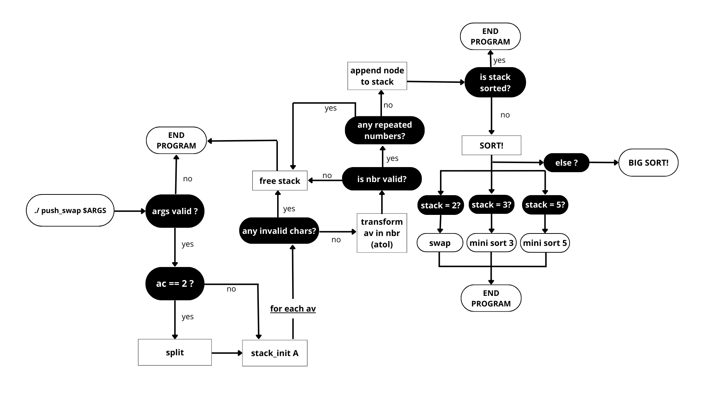
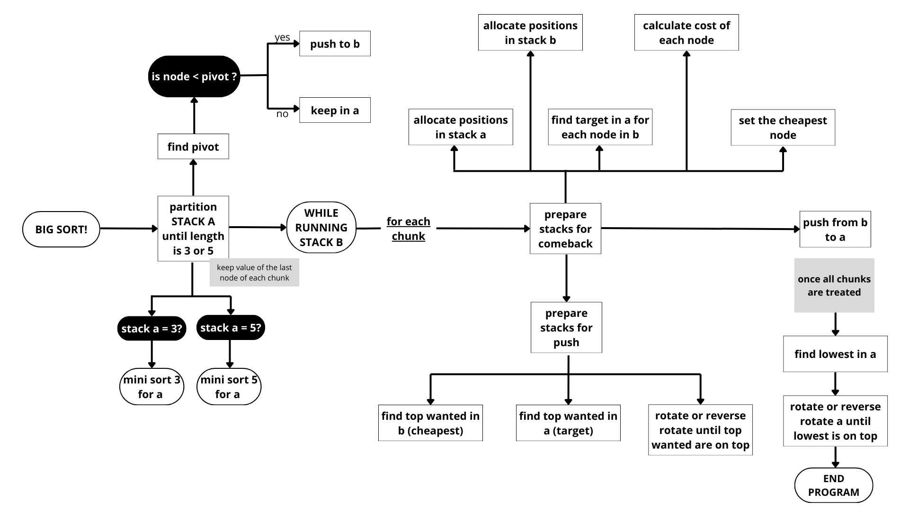

# PUSH_SWAP

## 1.1. About
This project aims to sort data on a stack, with a limited set of instructions, using the lowest possible number of moves.

## 1.2. Instructions
There are 2 stacks, named "a" and "b". In the beginning, the stack "a" contains a random amount of negative and/or positive intergers which cannot be duplicated. Stack B is empty. The goal is to sort in ascending order numbers into the stack "a" using stack "b". To do so, I have the following operations at my disposal:

| Code | Name | Description |
|:----:| :---:| :----------|
| `sa` | (swap a) | Swap the first 2 elements at the top of stack a. Do nothing if there is only one or no elements. |
| `sb` | (swap b) | Swap the first 2 elements at the top of stack b. Do nothing if there is only one or no elements. |
| `ss` | (swap a and swap b) | Do `sa` and `sb` at the same time. |Explanation Replace all val
| `pa` | (push a) | Take the first element at the top of `b` and put it at the top of `a`. Do nothing if `b` is empty. |
| `pb` | (push b) | Take the first element at the top of `a` and put it at the top of `b`. Do nothing if `a` is empty. |
| `ra` | (rotate a) | Shift up all elements of stack `a` by 1. The first element becomes the last one. |
| `rb` | (rotate b) | Shift up all elements of stack `b` by 1. The first element becomes the last one. |
| `rr` | (rotate a and rotate b) | Do `ra` and `rb` at the same time. |
| `rra` | (reverse rotate a) | Shift down all elements of stack `a` by 1. The last element becomes the first one. |
| `rrb` | (reverse rotate b) | Shift down all elements of stack `b` by 1. The last element becomes the first one. |
| `rrr` | (reverse rotate a and reverse rotate b) | Do `rra` and `rrb` at the same time. |
  
## 1.3. My push_swap program

### 1.3.1. Implementation and Algorithm
To develop this project, I've decided to implement my own algorithm based on the combination of 2 well-known algorithms: [quicksort](https://www.geeksforgeeks.org/quick-sort-algorithm/) and the [turk](https://medium.com/@ayogun/push-swap-c1f5d2d41e97).

#### Phase 0
The first thing to do is to make sure the algorithm is actually needed. For that, we ask some questions:
- Do we need to split the arguments?
- Are the characters valid? Are the numbers valid?
- Are there any repeated numbers?
- Are the numbers already sorted?
- Can we sort them with a mini sort of 3 or 5?
#### Phase 1
If we do need the algorithm, in a first phase, we use quicksort to pre-organize my stack, finding a pivot element and partitioning stack "a" recursively until I have only 3 or 5 elements left. 
At this point, all the partitioned elements are organized into chuncks of unsorted numbers in stack "b".
#### Phase 2
Then, I bring the elements back into stack "a", chunk by chunk, sorting them based on a "costing" and "target node" scheme: 
- I attribute an index to each element in "a" and "b";
- I find, in "a" the target node for each element in "b";
- I calculate which element in "b" is the cheapes to push back to "a";
- I make sure both the cheapest (in "b") and its target node (in "a") are at the top of both stacks;
- I bring the organized elements back from "b" to "a".
#### Phase 3
Finally, I look in "a" for the lowest number and rotate (or reverse rotate) the stack until the lowest value is at the top, making the stack sorted in an ascending order.

### 1.3.2. Workflow chart
For a more visual understanding, I've made a workflow that represents how my program works:

        
    

